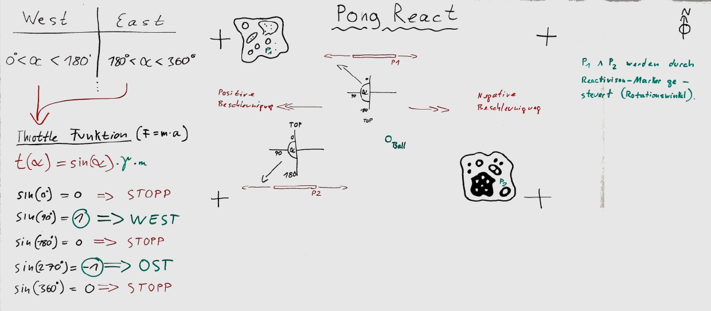

# Beispielanwendungen

1. [Pong](#pong-react)

## Pong React

**Pong React** ist die ReacTIVision-Implementation des Spieleklassikers "Pong". Hierbei
werden die Schläger allerdings nicht mit der Tastatur, sondern mit Marker-Würfeln gespielt.
Je nach Rotationswinkel wird der Schläger entweder nach links oder nach rechts bewegt.

Ziel des Spiels ist es, den Tennisball ins gegnerische Aus zu manövrieren.

Die Skizze zeigt, wie der Rotationswinkel in Richtung und Geschwindigkeit übersetzt wird.